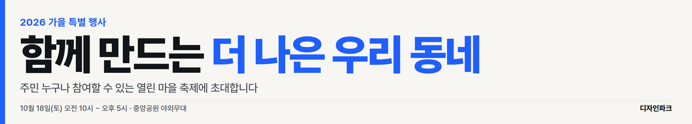
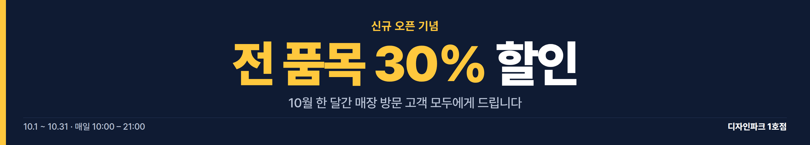

# design_parc

AI(Claude)와 함께 현수막·웹사이트·각종 디자인을 반복 제작하기 위한 작업 공간입니다.

---

## 1. 현수막 빠르게 만들기

내용은 JSON 한 파일에 적고, 명령 한 줄로 **인쇄용 PDF(실제 크기, 벡터)** 와 **미리보기 PNG** 를 만듭니다.

```bash
npm install                       # 최초 1회 (Playwright 설치)
npx playwright install chromium   # 로컬 PC 최초 1회 (브라우저 다운로드)
npm run banner -- banner/examples/sample.json
# → out/sample.pdf  (5000×900mm, 인쇄소 전달용)
# → out/sample.png  (미리보기)
```

### 예시 결과




### JSON 항목

| 항목 | 설명 | 예시 |
|---|---|---|
| `size.widthMm` / `size.heightMm` | 실제 현수막 크기(mm) | `5000` / `900` |
| `theme` | `light` · `navy` · `green` · `red` | `"light"` |
| `align` | `left` · `center` | `"center"` |
| `eyebrow` | 제목 위 작은 문구 | `"2026 가을 특별 행사"` |
| `title` | 핵심 문구. `*별표*`로 감싼 부분은 강조색 | `"함께 만드는 *더 나은 우리 동네*"` |
| `subtitle` | 보조 문구 | |
| `info` | 하단 왼쪽: 일시·장소 | |
| `org` | 하단 오른쪽: 주최/단체명 | |
| `colors` | 테마 색 덮어쓰기 (`bg`, `ink`, `sub`, `accent`, `line`) | `{ "accent": "#FF6A00" }` |

- 글자가 가로폭을 넘으면 자동으로 줄어듭니다. 줄바꿈은 `\n`.
- 폰트: [Pretendard](https://github.com/orioncactus/pretendard) (SIL OFL, 상업적 사용 무료) — `fonts/`에 포함.
- 자주 쓰는 현수막 규격: 가로형 5000×900mm, 3000×700mm / 세로형(족자) 600×1800mm 등. 인쇄소 규격을 확인해 `size`만 바꾸면 됩니다.

템플릿 디자인 자체는 `banner/template.html` (HTML/CSS)이라, Claude에게 "배경에 은은한 패턴 넣어줘", "로고 자리 추가해줘"처럼 말로 수정을 요청하기 쉽습니다.

---

## 2. 리서치: 공개 디자인 툴 리포지토리

기준: ① 오픈소스 공개 ② 결과물이 깔끔함 ③ AI(Claude 등)와 연결 가능(MCP·코드 기반). 스타 수는 2026-09 기준.

### A. 직접 쓰는 디자인 툴 (GUI 편집기)

| 리포지토리 | ★ | 특징 | AI 연동 |
|---|---|---|---|
| [penpot/penpot](https://github.com/penpot/penpot) | 60k | 오픈소스 Figma 대안. 웹/자체 호스팅, SVG 기반, 협업 | 공식 MCP 서버 [penpot/penpot-mcp](https://github.com/penpot/penpot-mcp) |
| [GraphiteEditor/Graphite](https://github.com/GraphiteEditor/Graphite) | 27k | 벡터·래스터·노드 기반 그래픽 편집기(Rust) | 아직 공식 MCP 없음 |
| [ZSeven-W/openpencil](https://github.com/ZSeven-W/openpencil) | 6k | "Design-as-Code" AI 네이티브 벡터 디자인 툴 | Claude Code·MCP 내장 |
| [kgoedecke/doop](https://github.com/kgoedecke/doop) | 0.8k | 사람과 AI 에이전트가 함께 쓰는 캔버스 | MCP 내장 |
| [hyscaler/HyCanvas](https://github.com/hyscaler/HyCanvas) | 0.2k | 자체 호스팅 Canva 대안(소셜 이미지·프레젠테이션) | 생성형 AI(BYOK) |
| [excalidraw/excalidraw](https://github.com/excalidraw/excalidraw) | 133k | 손그림 느낌 화이트보드·다이어그램 | [excalidraw/excalidraw-mcp](https://github.com/excalidraw/excalidraw-mcp) |
| [tldraw/tldraw](https://github.com/tldraw/tldraw) | 51k | 무한 캔버스 SDK(React) | [tldraw/make-real-starter](https://github.com/tldraw/make-real-starter) |

### B. 코드로 디자인하기 (AI가 직접 만들고 고치기 좋음)

| 리포지토리 | ★ | 용도 |
|---|---|---|
| [anthropics/skills](https://github.com/anthropics/skills) | 179k | Claude용 공식 스킬 모음 (frontend-design, canvas-design 등 디자인 스킬 포함) |
| [vercel/satori](https://github.com/vercel/satori) | 14k | HTML/CSS(JSX) → SVG 변환. 썸네일·OG 이미지 자동 생성 |
| [fabricjs/fabric.js](https://github.com/fabricjs/fabric.js) | 31k | 캔버스 편집기 라이브러리 (Canva류 편집기 직접 구축 시) |
| [salgum1114/react-design-editor](https://github.com/salgum1114/react-design-editor) | 1.7k | fabric.js 기반 React 디자인 편집기 |
| [google-labs-code/stitch-skills](https://github.com/google-labs-code/stitch-skills) | 8k | UI 디자인 생성 에이전트 스킬 (Claude Code 호환) |
| [Manavarya09/design-extract](https://github.com/Manavarya09/design-extract) | 4k | 마음에 드는 웹사이트의 디자인 시스템(색·폰트·토큰) 추출, MCP 지원 |
| [wilwaldon/Claude-Code-Frontend-Design-Toolkit](https://github.com/wilwaldon/Claude-Code-Frontend-Design-Toolkit) | 1.2k | Claude Code로 예쁜 프론트엔드를 뽑기 위한 스킬·MCP·팁 모음 |

### C. 영상 (추후)

| 리포지토리 | ★ | 용도 |
|---|---|---|
| [remotion-dev/remotion](https://github.com/remotion-dev/remotion) | 61k | React 코드로 영상 제작. 같은 디자인 토큰을 영상에도 재사용 가능 |
| [remotion-dev/skills](https://github.com/remotion-dev/skills) | 4.7k | Remotion용 에이전트 스킬 |

---

## 3. 추천 조합 (계속 고수할 도구)

1. **기본 작업 방식: HTML/CSS 템플릿 + Playwright 출력 (이 리포지토리)**
   - 현수막·포스터·SNS 이미지·웹사이트가 모두 같은 방식(HTML/CSS)이라, 한번 정한 색·폰트·여백 규칙을 모든 결과물에 재사용할 수 있습니다.
   - Claude가 코드를 직접 읽고 고치므로 AI 연동이 가장 자연스럽고, git으로 버전 관리됩니다.
   - 인쇄용 PDF가 벡터로 나와 5m 현수막도 선명합니다.
2. **손으로 미세 조정이 필요할 때: Penpot + penpot-mcp**
   - Figma와 비슷한 편집 화면, 무료·오픈소스, SVG 가져오기/내보내기 가능.
   - 공식 MCP 서버가 있어 Claude가 Penpot 파일을 직접 편집할 수 있습니다.
3. **영상: Remotion** — 위 1번과 같은 React/CSS 디자인을 그대로 영상으로 확장.
